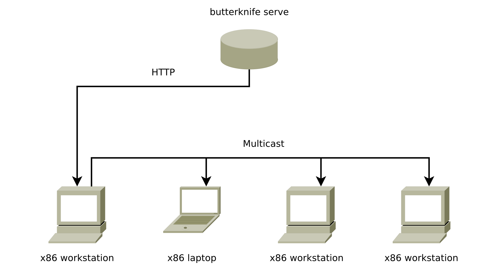
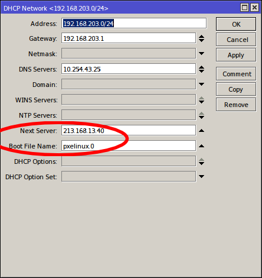
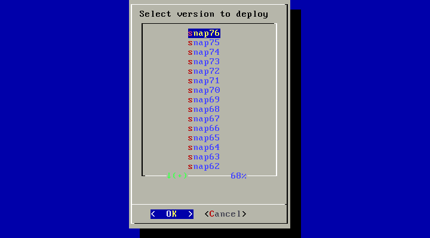
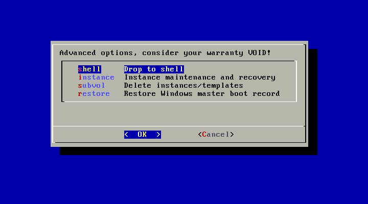
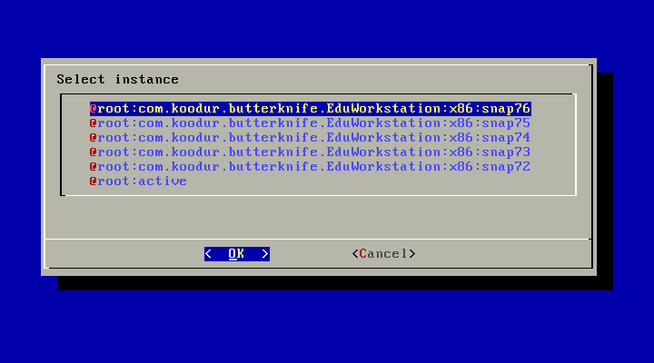

Butterknife provisioning suite
==============================

Butterknife makes bare-metal Linux deployment dead-simple using the Btrfs
filesystem and containers.

Detailed background of the work is described in
Master Thesis
`Efficient and Reliable Filesystem Snapshot Distribution
<https://owncloud.koodur.com/index.php/s/5KOgVze9X2cOUkD>`_.
    
General workflow
----------------

1. Prepare template of your customized OS in a LXC container
2. Boot provisioning image and deploy the template on bare metal
3. Enjoy using your favourite Linux-based OS :)

Features
--------

* Minified provisioning image (<15MB) which can be booted either over PXE or from USB key.
* Deploy customized Linux-based OS over HTTP in 5 minutes.
* Deploy hundreds of machines simultanously within same timeframe over multicast.
* Perform incremental upgrades using Btrfs.
* Persistent Btrfs subvolumes for home folders, Puppet keys etc.

Installation
------------

Current instructions are based on Ubuntu 14.04, but any modern Linux-based
OS should suffice.
First set up machine with Ubuntu 14.04 LTS on top of Btrfs filesystem to
be used as snapshot server.

Before doing any filesystem magic ensure that you're running 3.16+ kernel.
You can install Ubuntu 14.10 kernel on 14.04 simply by doing following:

.. code:: bash

    apt-get install linux-image-generic-lts-utopic
    
Make sure the root subvolume stays mounted at /var/butterknife/pool,
with a corresponding entry in /etc/fstab:

.. code::

    UUID=01234567-0123-0123-0123-0123456789ab /var/butterknife/pool btrfs defaults,subvol=/,noatime,nodiratime 0 2

Note that UUID in this case is the unique identifier of the Btrfs filesystem
which can be determined with **blkid** utility.
Make sure the LXC container directories are also mounted with *noatime*
and *nodiratime* flag otherwise all the access times reflect in differential
updates as well causing excessive traffic.
Make sure the LXC container and snapshot directories
reside in the same Btrfs filesystem as 
/var/butterknife/pool.

Finally install the Butterknife command-line utility
as described `here <host/>`_.

Getting up to date btrfs-progs
------------------------------

We are using some esoteric functions (-p and -C for btrfs receive) which are not available in
older btrfs-progs versions:

.. code:: bash

    sudo apt-get build-dep btrfs-progs
    wget https://github.com/v6sa/btrfs-progs/archive/v3.19.x.zip
    unzip v3.19.x.zip
    sudo apt-get build-dep btrfs-progs
    ./autogen.sh
    ./configure
    make
    sudo make install

Publishing workflow
-------------------

Create LXC container to be used as template for deployment, for instance to 
set up Ubuntu 14.04 based template use:

.. code:: bash

    lxc-create -n your-template -B btrfs -t ubuntu -- -r trusty -a i386
    
Customize mountpoints in /var/lib/lxc/your-template/fstab, for example:

.. code::

    /var/cache/apt/archives /var/lib/lxc/your-template/rootfs/var/cache/apt/archives none bind
    /etc/puppet/ /var/lib/lxc/your-template/rootfs/etc/puppet/ none bind,ro

Start and enter the container:

.. code:: bash

    lxc-start -d -n your-template
    lxc-attach -n your-template

Use your favourite configuration management tool to customize the template,
eg for Puppet users:

.. code:: bash

    puppet apply /etc/puppet/manifests/site.pp

Or just install and tweak whatever you need manually.
Futher instructions for customizing the template can be found `here <template/>`_.

Copy post-deploy, pre-release scripts and other helpers:

.. code:: bash

    rsync -av \
        path/to/butterknife/template/overlay/ \
        /var/lib/lxc/your-template/rootfs/
        
Create Butterknife configuration for the template in
/var/lib/lxc/your-template/rootfs/etc/butterknife/butterknife.conf:

.. code:: ini

    [template]
    name=YourTemplateName

Also create Butterknife configuration for the host in 
/etc/butterknife/butterknife.conf:

.. code:: ini

    [global]
    namespace=org.example.butterknife
    endpoint=https://butterknife.example.org
    
This results template snapshot names with following scheme:

.. code::

    @template:org.example.butterknife.YourTemplateName:x86:snap42
    @template:org.example.butterknife.YourTemplateName:x86:snap43
    @template:org.example.butterknife.YourTemplateName:x86:snap44
    etc ...

Use butterknife to take a snapshot of the LXC container:

.. code:: bash

    butterknife lxc release your-template
    
Finally fire up the HTTP API:

.. code:: bash

    butterknife serve http

Serving provisioning image over PXE
-----------------------------------

PXE is the preferred way of serving the provisioning image.
In this case Ubuntu/Debian is used to host the provisioning images.

.. code:: bash

    sudo apt-get install pxelinux
    cp /usr/lib/PXELINUX/pxelinux.0 /srv/tftp/
    cp /usr/lib/syslinux/modules/bios/*.c32 /srv/tftp/
    wget https://github.com/laurivosandi/butterknife/raw/master/pxe/butterknife-i386 \
        -O /srv/tftp/butterknife-i386
    wget https://github.com/laurivosandi/butterknife/raw/master/pxe/butterknife-amd64 \
        -O /srv/tftp/butterknife-amd64

Set up following in /srv/tftp/pxelinux.cfg/default:

.. code::

    default menu.c32
    prompt 0
    timeout 600
    menu title Butterknife provisioning tool

    label mbr
        menu label Boot from local harddisk
        localboot 0

    label butterknife
        menu label Deploy edu workstation (i386)
        kernel butterknife-i386
        append bk_url=https://butterknife.koodur.com/api/ bk_template=com.koodur.butterknife.EduWorkstation quiet

    label butterknife
        menu label Butterknife (amd64)
        kernel butterknife-amd64
        append bk_url=https://butterknife.koodur.com/api/ quiet

    label butterknife
        menu label Butterknife (i386, debug)
        kernel butterknife-i386
        append bk_url=https://butterknife.koodur.com/api/

    label memtest
        menu label Memtest86+
        linux memtest86+.bin
        

Setting up PXE boot
-------------------

If you're running ISC DHCP server add following to your subnet section
in /etc/dhcp/dhcpd.conf and restart the service:

.. code::

    next-server 213.168.13.40;
    filename "pxelinux.0";

If you have OpenWrt based router simply add following to 
the **config dnsmasq** section of /etc/config/dhcp and restart
the service:

.. code::

    option dhcp_boot 'pxelinux.0,,213.168.13.40'

If running vanilla *dnsmasq*, then simply add following to /etc/dnsmasq.conf
and restart the service:

.. code::

    dhcp-boot=pxelinux.0,,213.168.13.40
 
If you're using MikroTik's WinBox open up your DHCP network configuration and
set **Next Server** option to 213.168.13.40 and **Boot file name** option to 
pxelinux.0:

If you've set up your own TFTP server as described in the previous
section substitute 213.168.13.40 with your TFTP server's IP address.
 
Deployment workflow
-------------------

Butterknife provisioning image provides menu-driven user-interface
with simple Enter-Enter-Enter usage:

.. figure:: doc/img/butterknife-main-screen.png
    
We currently support HTTP, multicast and various combinations of both:
    
.. figure:: doc/img/butterknife-transfer-method.png

Partitioning choices feature also NTFS resize and incremental upgrades:

.. figure:: doc/img/butterknife-partitioning-method.png
    
Target disk selection:

.. figure:: http://lauri.vosandi.com/cache/c8683a45f56cc88895646b7090b021af.png
    
Partition selection:
    
.. figure:: http://lauri.vosandi.com/cache/c348448d183ea384b30bbdd4e590cab4.png
    
Template versions are actually snapshots:
    

These steps should be enough to deploy a Linux-based OS in no time.

Recovery console
----------------

In case you need to recover already deployed instance or delete old
templates pick Advanced Options from main menu which brings up following:

All instances can be easily entered via instance maintenance entry:

    
