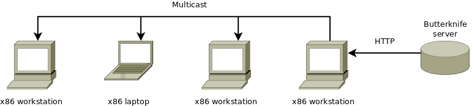

Butterknife provisioning suite
==============================

Butterknife makes Linux deployment dead-simple using the Btrfs filesystem
and LXC containers.

    Butterknife can be used to deploy hunders Linux workstations simultaneously
    
General workflow
----------------

1. Prepare template of your customized OS in a LXC container
2. Boot provisioning image and deploy the template
3. Enjoy using your favourite Linux-based OS :)

Features
--------

* Minified provisioning image (<15MB) which can be booted either over PXE or from USB key.
* Deploy customized Linux-based OS over HTTP in 5 minutes.
* Deploy hundreds of machines simultanously within same timeframe over multicast.
* Perform incremental upgrades using Btrfs.
* Persistent Btrfs subvolumes for home folders, Puppet keys etc.

Installation
------------

First set up machine with Ubuntu 14.04 LTS on top of Btrfs filesystem to
be used as snapshot server.

Before doing any filesystem magic ensure that you're running 3.16+ kernel.
You can install Ubuntu 14.10 kernel on 14.04 simply by doing following:

.. code:: bash

    apt-get install linux-image-generic-lts-utopic

Also install the latest version of btrfs-tools, versions 3.12 and 3.16
in Ubuntu repositories are known to be unusable:

.. code:: bash

    wget -c https://launchpadlibrarian.net/190998686/btrfs-tools_3.17-1.1_amd64.deb
    sudo dpkg -i btrfs-tools_3.17-1.1_amd64.deb

Publishing workflow
-------------------

Create LXC container to be used as template for deployment, for instance to 
set up Ubuntu 14.04 container use:

.. code:: bash

    lxc-create -n your-template -B btrfs -t ubuntu -- -r trusty -a i386

Start and enter the container:

.. code:: bash

    lxc-start -d -n your-template
    lxc-attach -n your-template

Use your favourite configuration management tool to customize the container,
eg for Puppet users:

.. code:: bash

    puppet apply /etc/puppet/manifests/site.pp

Or just install and tweak whatever you need manually.
To get a working Ubuntu 14.04 desktop install the corresponding metapackage,
this of course contains a lot of useless stuff if you're planning to manage the
image by yourself eg apport, update-notifier etc.

.. code:: bash

    lxc-attach -n your-template
    apt-get update
    apt-get install ubuntu-desktop

Copy post-deploy, pre-release scripts and other helpers:

.. code:: bash

    rsync -av \
        path/to/butterknife/template/overlay/ \
        /var/lib/lxc/your-template/rootfs/

Use butterknife to take a snapshot of the LXC container:

.. code:: bash

    butterknife-release -n your-template

Serving provisioning image over PXE
-----------------------------------

PXE is the preferred way of serving the provisioning image.
In this case Ubuntu/Debian is used to host the provisioning images.

.. code:: bash

    sudo apt-get install pxelinux
    cp /usr/lib/PXELINUX/pxelinux.0 /srv/tftp/
    cp /usr/lib/syslinux/modules/bios/*.c32 /srv/tftp/
    wget https://butterknife.koodur.com/api/provision/butterknife-i386 \
        -O /srv/tftp/butterknife-i386
    wget https://butterknife.koodur.com/api/provision/butterknife-amd64 \
        -O /srv/tftp/butterknife-amd64

Set up following in /srv/tftp/pxelinux.cfg/default:

.. code::

    default menu.c32
    prompt 0
    timeout 600
    menu title Butterknife provisioning tool

    label mbr
        menu label Boot from local harddisk
        localboot 0

    label butterknife
        menu label Deploy edu workstation (i386)
        kernel butterknife-i386
        append bk_url=https://butterknife.koodur.com/api/ bk_template=com.koodur.butterknife.EduWorkstation quiet

    label butterknife
        menu label Butterknife (amd64)
        kernel butterknife-amd64
        append bk_url=https://butterknife.koodur.com/api/ quiet

    label butterknife
        menu label Butterknife (i386, debug)
        kernel butterknife-i386
        append bk_url=https://butterknife.koodur.com/api/

    label memtest
        menu label Memtest86+
        linux memtest86+.bin
    root@buildbot:~# 

        

Setting up PXE boot
-------------------

If you're running ISC DHCP server add following to your subnet section
in /etc/dhcp/dhcpd.conf and restart the service:

.. code::

    next-server 213.168.13.40;
    filename "pxelinux.0";

If you have OpenWrt based router simply add following to 
the **config dnsmasq** section of /etc/config/dhcp and restart
the service:

.. code::

    option dhcp_boot 'pxelinux.0,,213.168.13.40'

If running vanilla *dnsmasq*, then simply add following to /etc/dnsmasq.conf
and restart the service:

.. code::

    dhcp-boot=pxelinux.0,,213.168.13.40
 
If you're using MikroTik's WinBox open up your DHCP network configuration and
set **Next Server** option to 213.168.13.40 and **Boot file name** option to 
pxelinux.0:

.. figure:: img/mikrotik-pxe-boot.png

If you've set up your own TFTP server as described in the previous
section substitute 213.168.13.40 with your TFTP server's IP address.
 
Deployment workflow
-------------------

Butterknife provisioning image provides menu-driven user-interface
with simple Enter-Enter-Enter usage:

.. figure:: http://lauri.vosandi.com/cache/85820b490471410cfb1833f074c5ae84.png

    The main menu has convenience entries for shell, reboot and shutdown.
    
.. figure:: http://lauri.vosandi.com/cache/c8683a45f56cc88895646b7090b021af.png

    Target disk selection lists /dev/sd[a-z] entries.
    
.. figure:: http://lauri.vosandi.com/cache/c348448d183ea384b30bbdd4e590cab4.png

    Partition selection.
